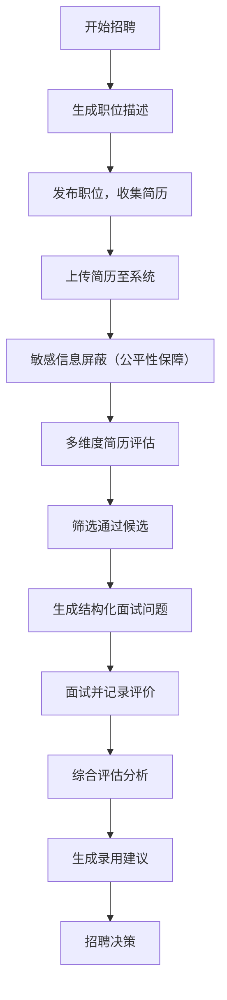

## 1. 产品概述

智能招聘辅助系统，旨在通过 AI 技术实现招聘全流程的智能化、客观化。系统帮助招聘人员快速生成精准职位描述，智能筛选简历并进行多维度评估，自动生成结构化面试题库，并提供客观的面试评价与录用建议。核心价值在于消除招聘过程中的性别、年龄、地域等人为偏见，确保招聘决策的公平性与客观性，提升招聘效率与质量。

## 2. 核心功能

### 2.1 用户角色
| 角色 | 注册方式 | 核心权限 |
|------|----------|---------|
| 招聘专员 | 系统登录 | 使用全部功能模块，管理招聘流程 |
| 面试官 | 系统登录 | 查看候选人信息，填写面试评价 |
| 招聘经理 | 系统登录 | 查看招聘数据，审批录用建议 |

### 2.2 功能模块
1. **职位描述生成页：输入岗位基础信息，自动生成专业、规范的职位描述
2. **简历筛选评估页：上传简历，进行技能匹配、经验相关性、发展潜力多维度评分
3. **面试问题生成页：根据职位要求自动生成结构化面试问题
4. **面试评价页：记录面试表现，生成综合评估报告
5. **录用建议页：基于全流程数据给出录用决策建议

### 2.3 页面详情
| 页面名称 | 模块名称 | 功能描述 |
|---------|---------|---------|
| 首页 | 功能导航 | 展示四大核心模块入口、招聘数据概览、快捷操作区 |
| 职位描述生成页 | 职位信息输入 | 输入岗位名称、部门、级别、核心职责等基础信息 |
| 职位描述生成页 | 智能生成 | 基于输入信息生成专业职位描述，支持编辑和导出 |
| 简历筛选评估页 | 简历上传解析 | 支持多种格式简历上传，自动解析关键信息 |
| 简历筛选评估页 | 多维度评估 | 技能匹配度、经验相关性、发展潜力综合评分 |
| 简历筛选评估页 | 偏见检测 | 自动检测并屏蔽性别、年龄、地域等敏感信息 |
| 面试问题生成页 | 问题分类生成 | 专业能力、软技能、文化适配三类问题自动生成 |
| 面试评价页 | 评价记录 | 结构化评分表，面试官评价记录 |
| 面试评价页 | 报告生成 | 自动生成结构化面试评价报告 |
| 录用建议页 | 综合分析 | 全流程数据整合，生成录用/不录用建议 |
| 录用建议页 | 决策依据 | 展示评分明细，提供可解释的决策理由 |

## 3. 核心流程

## 4. 用户界面设计

### 4.1 设计风格
- **主色调**：深海蓝 (#0F172A) 作为主色，代表专业与信赖
- **辅助色**：翡翠绿 (#10B981) 代表通过/合格，珊瑚橙 (#F97316) 代表警告/需关注
- **中性色**：石板灰系列 (#64748B) 作为文本与背景层次
- **按钮风格**：微圆角 (8px)，优雅的阴影层次，hover 状态有轻微上浮动画
- **字体**：标题使用 Playfair Display，正文使用 Inter
- **布局风格**：卡片式布局，清晰的视觉层次，充足留白
- **图标风格**：使用 lucide-react 线性图标，统一 24px 尺寸

### 4.2 页面设计概览
| 页面名称 | 模块名称 | UI 元素 |
|---------|---------|---------|
| 首页 | 功能导航 | 渐变背景 Hero 区，四大功能卡片矩阵，数据统计面板 |
| 职位描述生成页 | 表单区域 | 分步表单引导，实时预览生成效果 |
| 简历筛选评估页 | 评估面板 | 雷达图展示多维度评分，进度条动画 |
| 面试问题生成页 | 问题列表 | 可折叠分类，一键复制功能 |
| 面试评价页 | 评分区域 | 评分滑块，实时计算总分 |
| 录用建议页 | 决策面板 | 清晰的建议卡片，详细理由列表 |

### 4.3 响应式设计
- 桌面端优先设计，适配 1280px 及以上
- 平板端 768px-1279px 自适应两栏布局
- 移动端 375px-767px 单列布局，优化触控区域

### 4.4 动画与交互
- 页面加载：渐入动画，元素错落有致
- 卡片悬浮：轻微上浮 + 阴影加深
- 数据展示：数字滚动动画，图表渐入
- 按钮交互：缩放反馈
- 状态切换：平滑过渡动画
