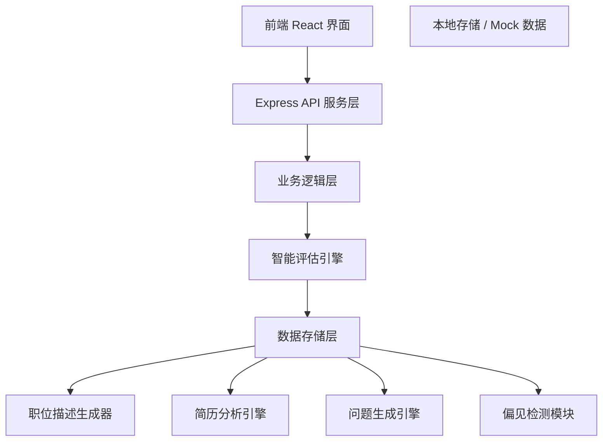

## 1. 架构设计



## 2. 技术选型

- **前端**：React@18 + TypeScript + Vite + TailwindCSS@3 + Zustand + React Router DOM
- **后端**：Express@4 + TypeScript
- **状态管理**：Zustand
- **图表**：recharts（用于雷达图、柱状图等数据可视化）
- **图标**：lucide-react
- **数据存储**：本地 Mock 数据 + localStorage 持久化
- **UI 组件**：shadcn/ui 组件库
- **表单处理**：react-hook-form

## 3. 路由定义

| 路由 | 页面 | 说明 |
|-----|-----|-----|
| / | 首页 | 功能导航与数据概览 |
| /job-description | 职位描述生成 | 职位信息输入与生成 |
| /resume-screening | 简历筛选评估 | 简历上传与多维度评估 |
| /interview-questions | 面试问题生成 | 结构化面试问题生成 |
| /interview-evaluation | 面试评价 | 面试记录与评价 |
| /hiring-decision | 录用建议 | 综合评估与录用决策 |

## 4. API 定义

### 4.1 类型定义

```typescript
// 职位信息
interface JobPosition {
  id: string;
  title: string;
  department: string;
  level: string;
  responsibilities: string[];
  requirements: string[];
  skills: string[];
  generatedDescription: string;
  createdAt: Date;
}

// 简历信息
interface Resume {
  id: string;
  name: string;
  education: Education[];
  experience: Experience[];
  skills: string[];
  projects: Project[];
  rawContent: string;
  maskedContent: string;
}

// 评估结果
interface EvaluationResult {
  resumeId: string;
  skillMatch: {
    score: number;
    details: SkillMatchDetail[];
  };
  experienceRelevance: {
    score: number;
    details: ExperienceDetail[];
  };
  potential: {
    score: number;
    details: PotentialDetail[];
  };
  overallScore: number;
  biasCheck: BiasCheckResult;
}

// 偏见检测结果
interface BiasCheckResult {
  detectedFields: string[];
  maskedFields: string[];
  isFair: boolean;
}

// 面试问题
interface InterviewQuestion {
  id: string;
  category: 'professional' | 'softSkill' | 'culturalFit';
  question: string;
  expectedPoints: string[];
}

// 面试评价
interface InterviewEvaluation {
  id: string;
  resumeId: string;
  scores: {
    professional: number;
    softSkill: number;
    culturalFit: number;
  };
  notes: string;
  overallComment: string;
}

// 录用建议
interface HiringRecommendation {
  id: string;
  resumeId: string;
  recommendation: 'hire' | 'reject' | 'pending';
  reasons: string[];
  overallScore: number;
  finalDecision: string;
}
```

### 4.2 API 接口

```typescript
// 职位描述相关
POST /api/job-description/generate
Request: { title, department, level, responsibilities, requirements }
Response: { description, suggestions }

// 简历相关
POST /api/resume/upload
Request: FormData (resume file)
Response: { resumeId, parsedData }

POST /api/resume/evaluate
Request: { resumeId, jobPositionId }
Response: { evaluationResult }

GET /api/resume/list
Response: Resume[]

// 面试问题相关
POST /api/interview-questions/generate
Request: { jobPositionId, resumeId }
Response: { questions: InterviewQuestion[] }

// 面试评价相关
POST /api/interview-evaluation/submit
Request: InterviewEvaluation
Response: { success, evaluationId }

// 录用建议相关
POST /api/hiring-recommendation/generate
Request: { resumeId }
Response: HiringRecommendation

// 偏见检测
POST /api/bias/check
Request: { content }
Response: BiasCheckResult
```

## 5. 数据模型

### 5.1 ER 图

```mermaid
erDiagram
    JOB_POSITION ||--o{ RESUME : "has_many
    JOB_POSITION ||--o{ INTERVIEW_QUESTION : "generates"
    RESUME ||--|| EVALUATION_RESULT : "has"
    RESUME ||--o{ INTERVIEW_EVALUATION : "has"
    RESUME ||--|| HIRING_RECOMMENDATION : "has"
    EVALUATION_RESULT ||--|| BIAS_CHECK_RESULT : "includes"
```

### 5.2 核心业务逻辑模块

1. **职位描述生成器**
   - 基于岗位模板库
   - 行业术语标准化
   - 职责描述优化
   - 任职资格匹配

2. **简历分析引擎**
   - 关键词提取
   - 技能匹配算法
   - 经验相关性计算
   - 发展潜力评估模型

3. **偏见检测模块**
   - 性别词汇检测
   - 年龄信息检测
   - 地域信息检测
   - 敏感信息屏蔽

4. **问题生成引擎**
   - 专业能力问题库
   - 软技能问题模板
   - 文化适配问题集
   - 难度等级匹配

5. **综合评估模型**
   - 多维度加权评分
   - 决策依据生成
   - 录用建议算法
